# EX:5 DATA VISUALIZATION USING MATPLOT LIBRARY

# Aim:
  To Perform Data Visualization using matplot python library.

# EXPLANATION:
Data visualization is the graphical representation of information and data. By using visual elements like charts, graphs, and maps, data visualization tools provide an accessible way to see and understand trends, outliers, and patterns in data.

# Algorithm:
STEP 1:Include the necessary Library.

STEP 2:Read the Data.

STEP 3:Apply data visualization techniques to identify the patterns of the data.

STEP 4:Apply the various data visualization tools wherever necessary.

STEP 5:Include Necessary parameters in each functions.

# Coding and Output:
### TO CAPTURE A TREND
### 1.Line Chart
```py
import matplotlib.pyplot as plt
import numpy as np
x=[0,1,2,3,4,5]
y=[0,1,4,9,16,25]
plt.plot(x,y)
plt.show()
```
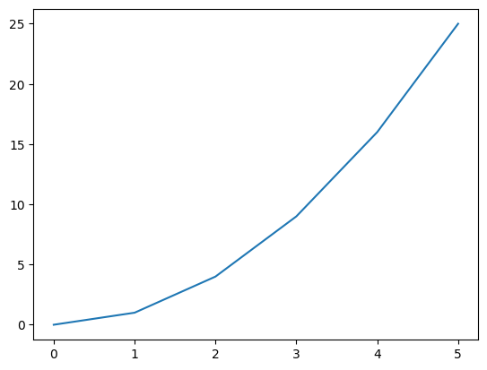

### 2.Multi-Line Chart
```py
x1=[1,2,3]
y1=[2,4,1]
plt.plot(x1,y1,label="line 1")
x2=[1,2,3]
y2=[4,1,3]
plt.plot(x2,y2,label="line 2")
plt.xlabel('x-axis')
plt.ylabel('y-axis')
plt.title('Multi-Line Chart')
plt.legend()
plt.show()
```
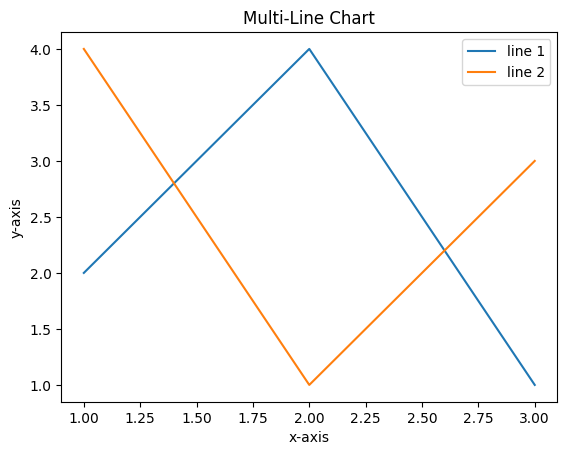

### 3.Area Chart
```py
x=[1,2,3,4,5]
y1=[10,12,14,16,18]
y2=[5,7,9,11,13]
y3=[2,4,6,8,10]
plt.fill_between(x,y1,color='blue')
plt.fill_between(x,y2,color='green')
plt.plot(x,y1,color='red')
plt.plot(x,y2,color='black')
plt.legend(['y1','y2'])
plt.show()
```
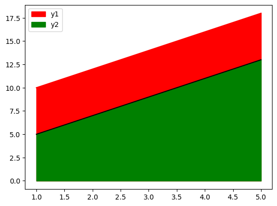

### 4.Stacked Area Chart
```py
plt.stackplot(x,y1,y2,y3,labels=['Line 1','Line 2','Line 3'])
plt.legend(loc='upper left')
plt.title('Stacked Line Chart')
plt.xlabel('X-axis')
plt.ylabel('Y-axis')
plt.show()
```
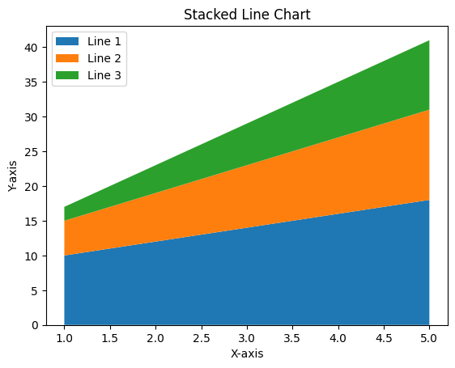

### 5.Spline Chart
```py
from scipy.interpolate import make_interp_spline
x=np.array([1,2,3,4,5,6,7,8,9,10])
y=np.array([2,4,5,7,8,8,9,10,11,12])
spl=make_interp_spline(x,y)
x1=np.linspace(x.min(),x.max(),100)
y1=spl(x1)
plt.plot(x,y,'*',label='data')
plt.plot(x1,y1,'-',label="spline")
plt.legend()
plt.show()
```
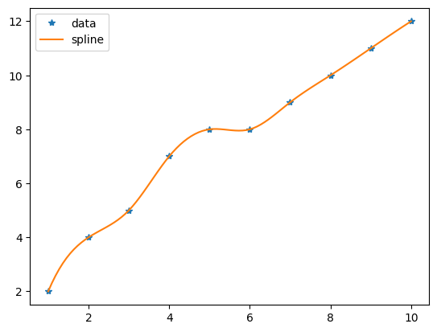

### TO VISUALIZE RELATIONSHIPS
### 1.Bar Chart
```py
val=[5,6,3,7,2]
names=["A","B","C","D","E"]
plt.bar(names,val,color="blue")
plt.show()
```
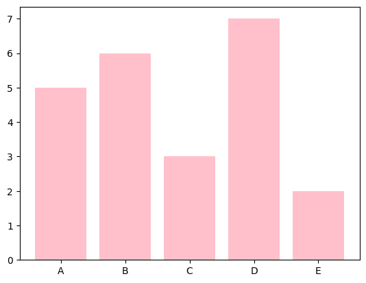

### 2.Scatter Plot
```py
x=[0,1,2,3,4,5]
y=[0,1,4,9,16,25]
plt.scatter(x,y,s=30,color="red")
plt.show()
```
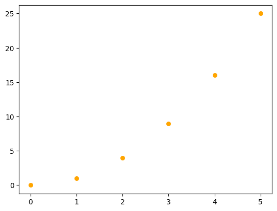

### 3.Bubble Chart
```py
x = [1, 2, 3, 4, 5]
y = [10, 15, 20, 25, 30]
sizes = [100, 200, 300, 400, 500]
plt.scatter(x, y, s=sizes, alpha=0.5)
plt.xlabel('x_values')
plt.ylabel('y_values')
plt.title('Bubble Chart')
plt.show()
```
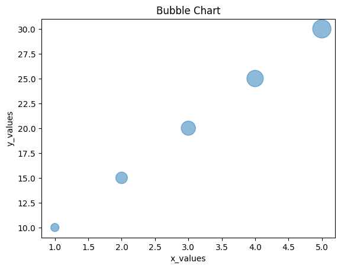

### TO CAPTURE DISTRIBUTIONS
### 1.Histogram
```py
ages=[2,5,70,40,30,45,50,45,43,40,44,60,7,13,57,18,90,77,32,21,20,40]
range=(0,100)
bins=10
plt.hist(ages,bins,range,color='purple',histtype='bar',rwidth=0.8)
plt.xlabel('age')
plt.ylabel('No. Of People')
plt.title('Histogram')
plt.show()
```
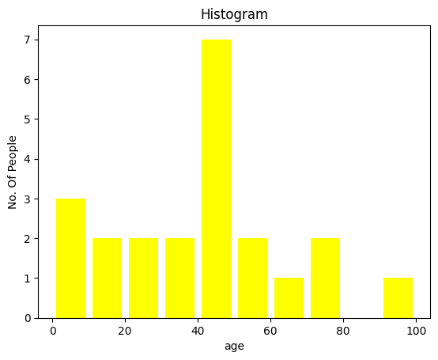

### 2.Box Plot
```py
np.random.seed(0)
data=np.random.normal(loc=0,scale=1,size=100)
data
fig,ax=plt.subplots()
ax.boxplot(data)
ax.set_xlabel('Data')
ax.set_ylabel('Values')
ax.set_title('Box Plot')
```
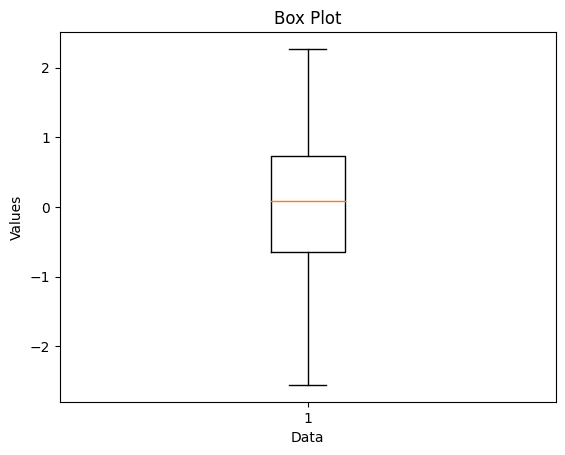

### 3.Violin Plot
```py
data = [np.random.normal(loc=0, scale=1, size=100),
        np.random.normal(loc=2, scale=1, size=100),
        np.random.normal(loc=1, scale=2, size=100)]
plt.violinplot(data)
plt.xlabel('Groups')
plt.ylabel('Values')
plt.title('Violin Plot')
plt.xticks([1, 2, 3], ['Group 1', 'Group 2', 'Group 3'])
plt.show()
```

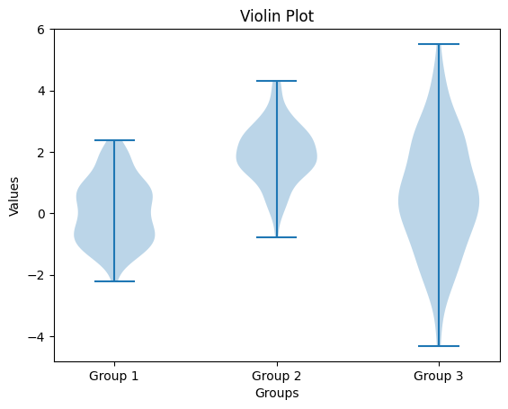

### 4.Density Chart
```py
data = np.random.normal(0, 1, 1000)
plt.hist(data, bins=30, density=True, alpha=0.5)
plt.title('Density Plot Example')
plt.xlabel('Values')
plt.ylabel('Density')
from scipy.stats import gaussian_kde
kde = gaussian_kde(data)
x_vals = np.linspace(min(data), max(data), 1000)
plt.plot(x_vals, kde(x_vals), 'r')
plt.show()
```

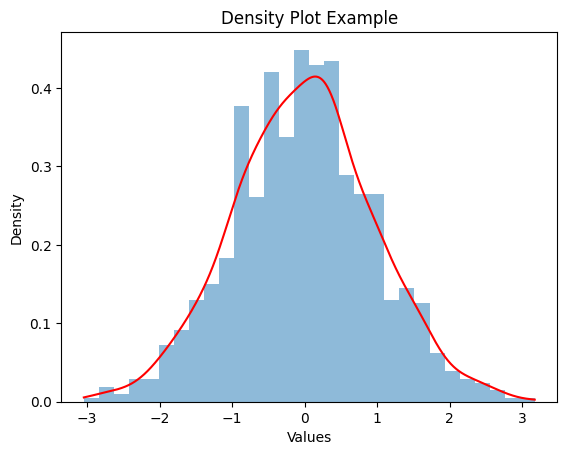

### 5.Pie Chart
```py
act=['eat','sleep','work','play']
slices=[3,7,8,6]
color=['r','y','g','b']
plt.pie(slices,labels=act,colors=color,startangle=90,shadow=True,explode=(0.1,0.1,0.1,0.1),radius=1.2,
autopct='%1.1f%%')
plt.legend()
plt.show()
```

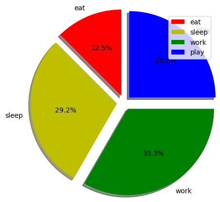

# Result:
  The Data Visualization using matplot python library is implemented successfully.

